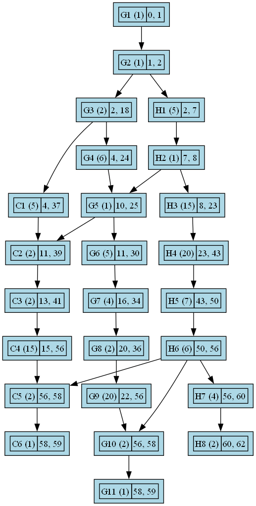

# PERT Diagram implementation and visualization in C++

This is a simple implementation of PERT Diagram in C++ using Graphviz for visualization.

## How to use

1. Clone the repository
2. Run the main.cpp file
3. The program will generate a file called `tasks.png` which contains the PERT Diagram.

## Example

An example of data needed to run the program is provided in the `data/tasks.json` file.
The json file should contain the following fields:

```json
{
    "data" [
        {
            "resource": "resource_name", // string
            "tasks": [
                {
                    "id": "task_id", // string
                    "name": "task_name", // string
                    "duration": "task_duration", // int
                    "predecessors": ["task_id1", "task_id2", ...] // array of strings
                }
            ]
        }
    ]
}
```

Output:

<div align=center>
    
</div>

## Author

[Ahmed Idrissi](https://ahmedidrissi.com)